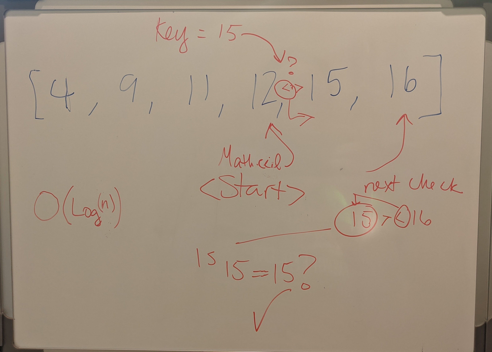

# Binary Search in Sorted Array

<!-- Short summary or background information -->

## Challenge

Taking in a sorted array, use a binary search to find a key that matches an element in the array, without using built-in methods

## Approach & Efficiency

- binary search looking for the middle index and checking if bigger or lesser helps us not have to look at every element in the array
- using greater or less than the defined key helps us distill the length of the array quickly

Big O:

- Time: O(Log(n))
- Space: O(n)

## Whiteboard
<!-- Embedded whiteboard image -->
