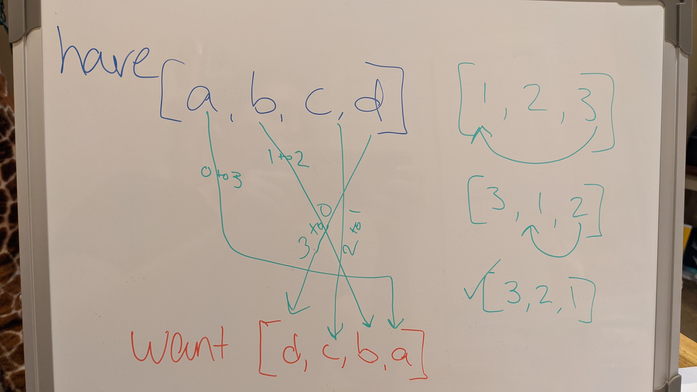

# Reverse an Array

<!-- Short summary or background information -->

## Challenge

Reverse an array in javascript, without using built-in methods

## Approach & Efficiency

- Iterate the array with a for loop
- Let i start with the end of the array an work backwards
- Push the iterated element onto a new array as you go

Big O:

- Time: O(n)
- Space: O(n)

## Whiteboard Solution
<!-- Embedded whiteboard image -->

