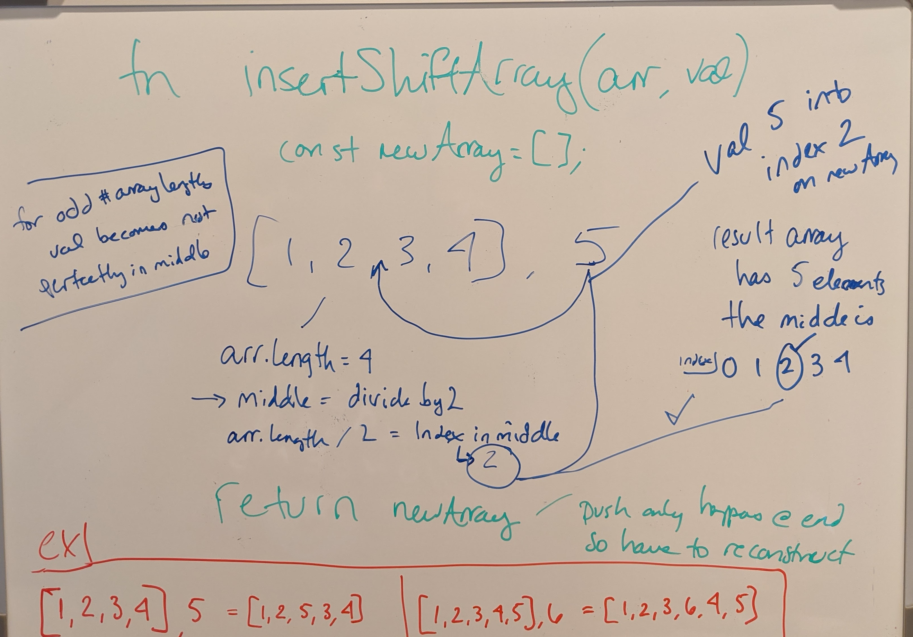

# Shift and Insert into Array

<!-- Short summary or background information -->

## Challenge

Shift around an original array and insert a new value in the middle of the new array, without using built-in methods

## Approach & Efficiency

- The original array will need to be made into a new array that includes the new value
- Find the middle of the old array for where to insert the new value
- Iterate over the original array and push the original elements and new value (in it's spot) onto the new array.

Big O:

- Time: O(n)
- Space: O(n)

## Whiteboard
<!-- Embedded whiteboard image -->
