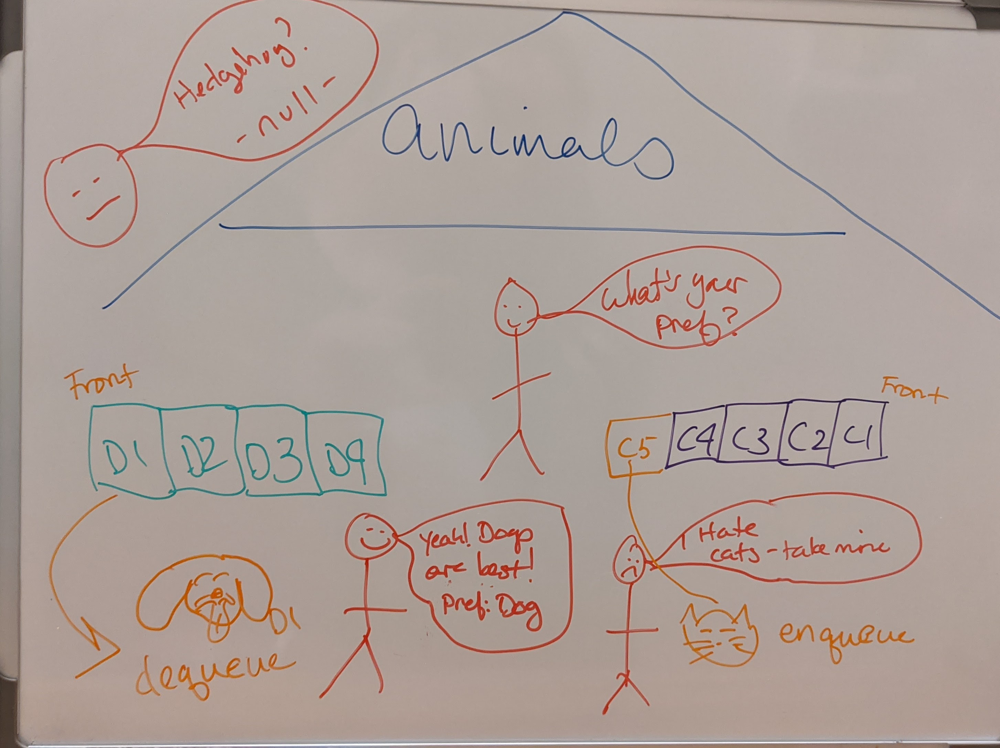

# Implement an Animal Shelter with 2 Queues (Dogs, Cats)

<!-- Short summary or background information -->

## Challenge

Create a class for called AnimalShelter that has 2 methods `enqueue` and `dequeue` to work either cats or dogs

## Approach & Efficiency

- Created new class with two methods that requires Queue class from another file
- The methods check if input is either cat or dog
- Other animals cannot be added or taken
- There are 2 different queue's for each dog / cat that actions the method

Big O:

- Time: O(n)
- Space: O(1)

## Whiteboard for Challenge 12
<!-- Embedded whiteboard image -->
#### CC12
