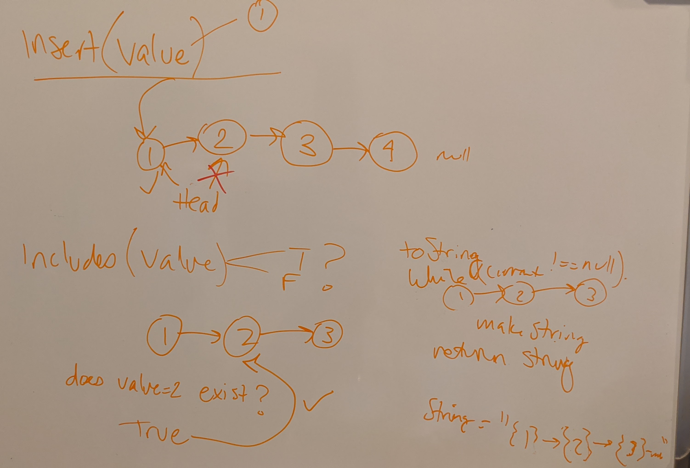
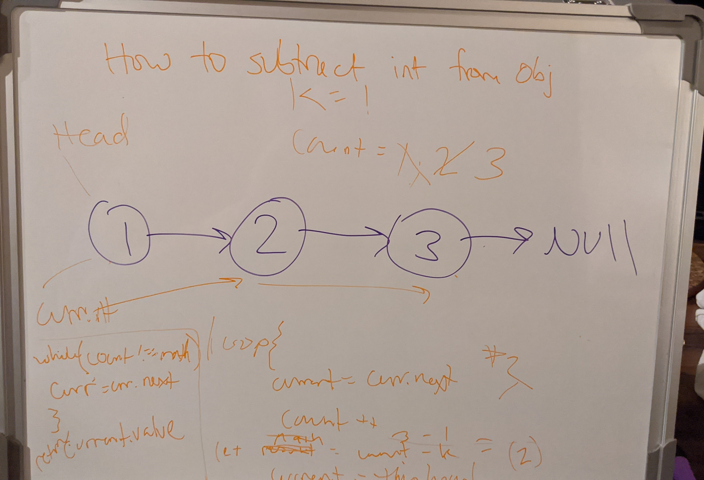
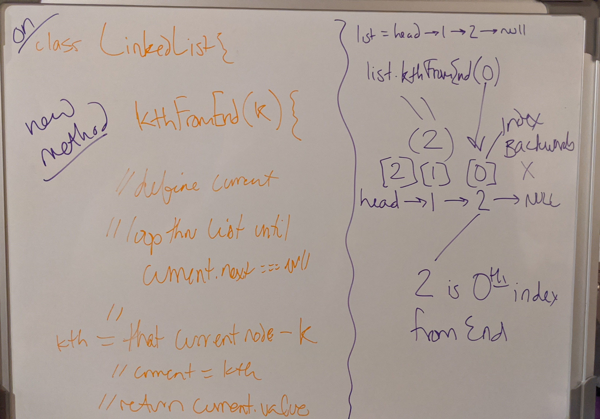

# Implement Singly Linked List

<!-- Short summary or background information -->

## Challenge

CC05: Create a Node and Linked List class. Include methods for `insert`, `includes`, `toString`
CC06: Extend Linked List class - Include methods for `append`, `insertBefore`, `insertAfter`
CC07: Extend LL class from CC05 that grabs the value of a node that is `kthFromEnd`

## Approach & Efficiency

- Create Node and Linked List class 
- Build methods on the Linked List class to manipulate the LL
- When needing to iterate over the LL, it's best to use a while loop and reference the current node
- For specific insertions, do this by checking the value of the `next` property of the given current node
- Because there are not indexes for the list, I added a count variable to be able to count back through the list to find the value

Big O:

- Time: O(n)
- Space: O(n)

## Whiteboard for Challenges 5 - 7
<!-- Embedded whiteboard image -->
#### CC05

#### CC06

#### CC07

