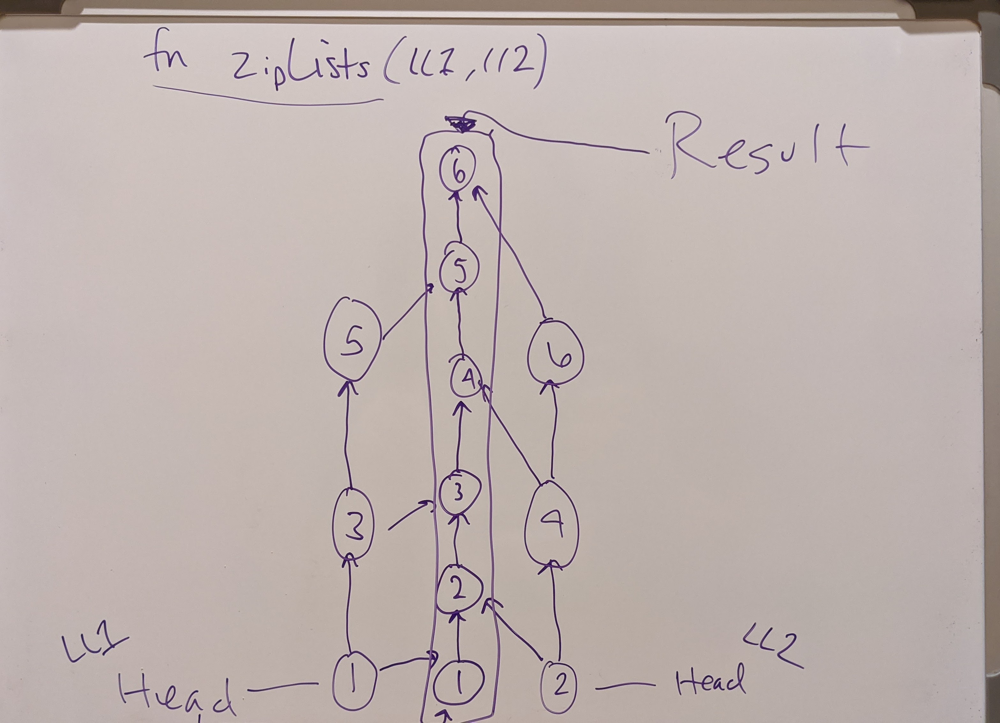

# Zip Two Linked Lists

<!-- Short summary or background information -->

## Challenge

Write a function `zipLists` which takes two lists and returns 1 list. Ideally aiming for BigO(1) space (not copying any nodes). The nodes should alternate as they stack into one list.

## Approach & Efficiency

- Use the Node and LinkedList classes from previous days (require)
- The function should identify 2 diff heads and 2 diff currents for use
- Change up what each node.next points to, bringing list 2 into list 1

Big O:

- Time: O(n)
- Space: O(1)

## Whiteboard for Challenges 5 - 7
<!-- Embedded whiteboard image -->
#### CC08

